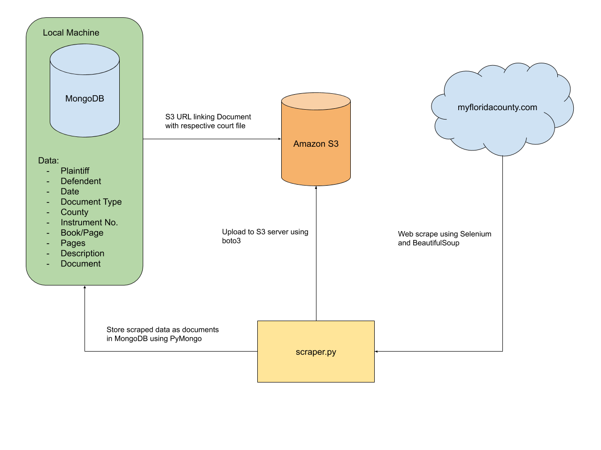
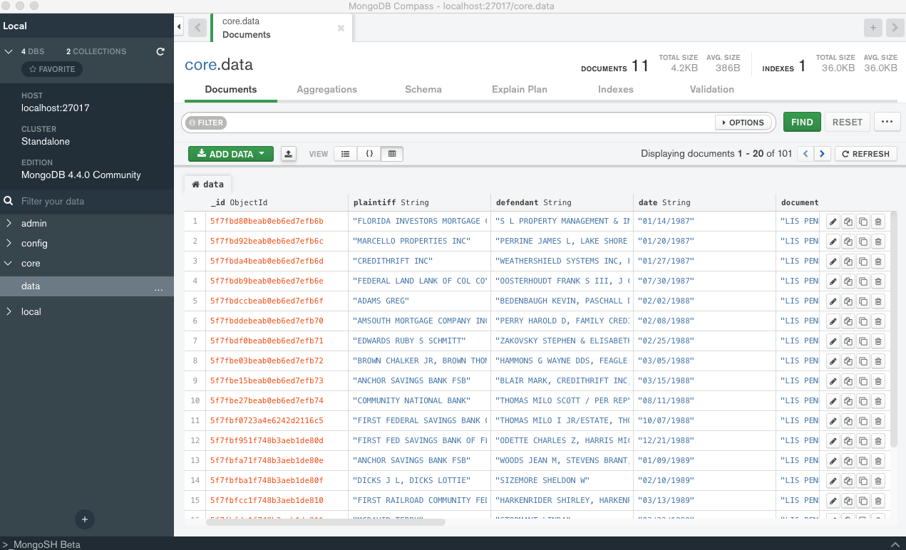
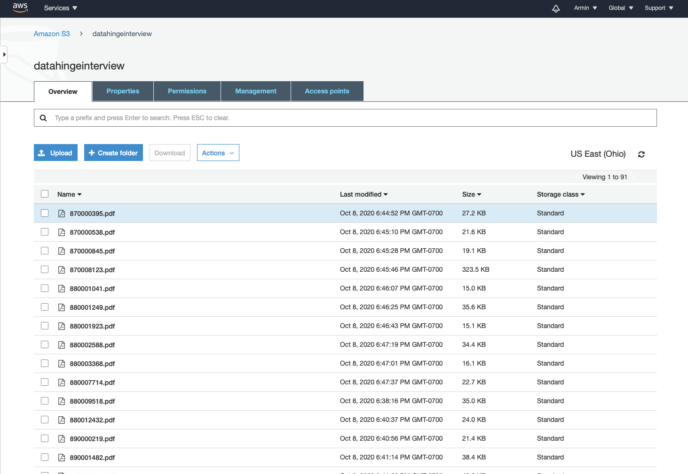

# DataHinge Interview Challenge

### Introduction

scraper.py is used to scrape Lis Pendens from MyFloridaCounty.com, and storing the data as documents in a MongoDB database. The database is exported as a JSON file in then data directory

#### MongoDB

The data was stored locally on my machine in a MongoDB database. The document model is as follows:

{

Plaintiff: Name of the plaintiff of the case

Defendant: Name of the defendant of the case

Date: Case date

Document Type: Lis Pendens

County: Columbia

Instrument Number: Records number

Book/Page: Record book and page

Pages: Number of pages in the court filing

Description: Address, Case Number or both

Document: The court document in the S3 server

}

#### Amazon S3 Server

This server is used to host the downloaded court files. This was achieved by scraping the court documents onto the local machine and simultaneously uploading it to the server using an IAM user through the boto3 module. The documents are all public and can be accessed through the link in the database.

### Requirements

The required modules for this program is in the file requirements.txt. To install the packages, just run `pip install -r requirements.txt`

Some of the modules used in this program are:

PyMongo - interact with the MongoDB database through python

Boto3 - create a session that connects to the aws servers using IAM credentials

Selenium - interact with the search queries using the Chrome driver

### Evaluation

#### Challenges

-   It's easy to get the url for the pdf as it just makes a call to a REST API using the instrument number. However, you have to have an active search query session inorder to access the pdf i.e. just entering the url without accessing the search results will not let us access the pdf. Hence the driver that accessed the search results should be the one to access the pdf. This meant that I couldnt use any modules to render pdfs through python, but rather download them through Selenium (something it wasn't designed to directly achieve). Hence I had to come up with a work around by printing the current page to pdf.
-   Once the page is printing to pdf, Selenium has no way to know when the file is downloaded and hence does not wait until the download is complete and proceeds to the next file, interrupting the download process. I had to implement a system that would check the download directory to validate that the file was downloaded, and only then is the proceeding code permitted to execute.

#### Strenghts

-   The code is fully automated and thus can be scallable for any number of search queries. Right now, we were capped at 101 queries but theoritically this program could handle any number of documents
-   This skeleton can be used as a template to scrape any other type of documents from any other county/state's website due to the versatility of Selenium and the way the print to pdf is implemented

#### Weaknesses

-   The pdf could not be directly accessed with a url since we had to be in the same session as when we made the initial search query. Thus, the same driver that accessed the search results has to be the one to access the pdf files. This makes the program traverse through the data linearly, which is very inefficient especially since we have to wait for the pdf to finish downloading before acessing the next, increasing time inefficiencies

#### Observations

Four of the entries in the MyFloridaCounty.com's database had no court document associated with them. Since the program would download the entire page to pdf, instead of throwing an error, or skipping the entry, it downloaded the error message and added it as an entry. Thus, the document in the MongoDB database still had all other informationm of the court filing, without the court document
